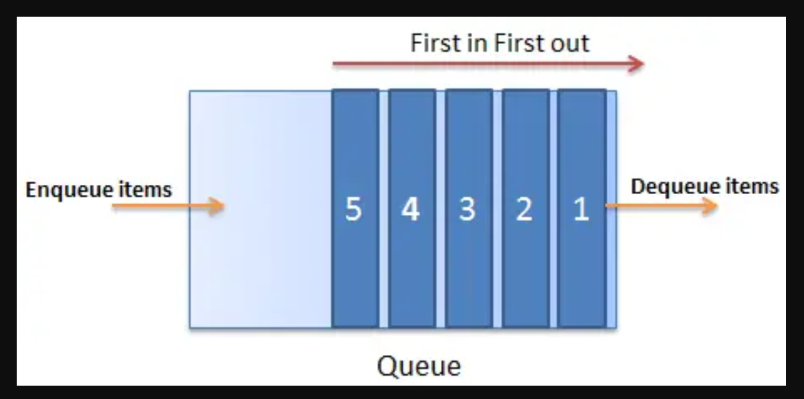

# Queues

Queues in c# are a simple data structure class that follows a basic system of first in and first out principle, as shown below:



But if someone wants to effectivily use this data structure, it must first understand the three major methods of handling the item elements inside the queue.
## Creating Queues

To create a queue you should write a code as it follows:

```csharp
using System;
using System.Collections.Generic;

class Program
{
    public static void Main()
    {
        // queue creation 
        Queue<string> bands = new Queue<string>();
    }
}
```

it is simple code that uses the namespace System.Collection.Generic, after writing this code you will end up with a empty queue, so you will need to use methods to make better use of this concept. 

## Queue Enqueue() Method

Enqueue method is used to insert items to the end of the queue, code exemple:

```csharp
using System;
using System.Collections.Generic;

class Program
{
    public static void Main()
    {
        Queue<string> bands = new Queue<string>();

        // adds "Metallica" and "AC/DC" to the queue
        bands.Enqueue("Metallica");
        bands.Enqueue("AC/DC");

        // print elements of the queue 
        foreach (string element in bands)
        {
            Console.WriteLine(element);
        }
    }
}
```

Some important details about this code is that to proper use a queue, it is necessary to keep in mind that when you create a queue you need to declare a type(string,int,float and etc...), so if you want to insert any item to the queue you need to make sure that item is the same type as the type that you declare in the queue.Moreover, it is also important to understand that a queue works in a very similar way, so if you want to print in the console all your itens in the queue, you should use a foreach loop that will return all the itens in the queue, just like it would do to a list.

## Queue Dequeue() Method

The Dequeue() Method is used to remove the first item in the queue, code exemple:

```csharp
using System;
using System.Collections.Generic;

class Program
{
    public static void Main()
    {
        Queue<string> bands = new Queue<string>();

        // adds "Metallica" and "AC/DC" to the queue
        bands.Enqueue("Metallica");
        bands.Enqueue("AC/DC");

       // removes element from the beginning of the bands queue 
        var removedElement = bands.Dequeue();

        Console.WriteLine("Removed Element: " + removedElement);
    }
}
```

A important detail to adress is that this method not only removes an elemente in the queue, it also returns that value.

## Queue Peek() Method

Queue Peek() Method is used to return the first element in the queue without removing it, code exemple:

```csharp
using System;
using System.Collections.Generic;

class Program
{
    public static void Main()
    {
        Queue<string> bands = new Queue<string>();

        // adds "Metallica" and "AC/DC" to the queue
        bands.Enqueue("Metallica");
        bands.Enqueue("AC/DC");

      // it only returns elements from the beginning of the bands queue
        Console.WriteLine("Element at beginning of queue: " + bands.Peek());
    }
}

```
## Exemple: Spotify
With queues you can create lists with your favorit songs to listen in your phone, with the enqueue() method you can add to the queue your favorit songs and with the dequeue() method you can remove songs, and with Peek() method you can print them in the console.
## Problem to solve: Create a Spotify Queue
With all the knowledge that you learn in this tutorial, you are ready to create your personal spotify queue, and  after you create you will need to remove the first item in your queue and display it, and after that you should the display the new first item in your queue.
## sample solution:
[solution](queues_solution/linked_list_solution/Program.cs)