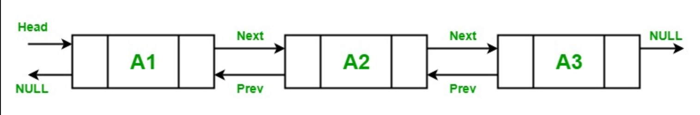

# Linked list 

linked lists in c# are linear data structures, in which the elements are not stored at contiguous memory locations. The elements in linked lists are linked by using pointers as the image shows:



Therefore, linked lists have nodes that contains data fields, and each node is connected with the next node in the list.
## Creating and Manipulating Linked List

To create a linked list you should write a code as it follows:

```csharp
using System;
using System.Collections.Generic;
 
class Program {
 
    // Main Method
    static public void Main()
    {
 
        // Creating a linkedlist
        LinkedList<String> bandList = new LinkedList<String>();
    }
}
```

it is simple code that uses the namespace System.Collection.Generic, after writing this code you will end up with a empty Linked List, so you will need to use methods to make better use of this concept. 
## methods of adding elements to the list
AddFirst: This method is used to add a new node or value at the start of the LinkedList.
AddLast: This method is used to add a new node or value at the end of the LinkedList.
AddAfter: This method is used to add a new node or value after an existing node in the LinkedList, 
AddBefore: This method is used to add a new node or value before an existing node in the LinkedList.
code exemple:
```csharp
using System;
using System.Collections.Generic;
 
class Program {
 
    // Main Method
    static public void Main()
    {
        LinkedList<string> bandList = new LinkedList<string>();
        // create a node and use the AddFirst() to add a element to the node.
        LinkedListNode<string> slipknotNode= bandList.AddFirst("Slipknot");
        // and then you use the AddLast() method to add a element to the node that you created.
        LinkedListNode<string> metallicaNode = bandList.AddLast("Metallica");
        // after that you can use the AddAfter([name of the node], [element you wish to add]) to add a element after the node that you created and you can use the AddBefore([name of the node], [element you wish to add]) to add a element before the node that you created.
        bandList.AddAfter(metallicaNode, "Aerosmith");
        bandList.AddBefore(slipknotNode, "Iron Maiden");
        Print(bandList);
    }
    private static void Print(LinkedList<string> bandList)
    { 
        foreach (var node in bandList)
        {
            Console.Write(node + ", ");
        }
        Console.WriteLine("\n");        
    }
}
```
## methods of removing elements from linked list
Clear(): This method is used to remove all nodes from the LinkedList.
Remove(LinkedListNode): This method is used to remove the specified node from the LinkedList.
Remove(T): This method is used to remove the first occurrence of the specified value from the LinkedList.
RemoveFirst(): This method is used to remove the node at the start of the LinkedList.
RemoveLast(): This method is used to remove the node at the end of the LinkedList.
code exemple:
```csharp
using System;
using System.Collections.Generic;
 
class Program {
 
    // Main Method
    static public void Main()
    {
        LinkedList<string> bandList = new LinkedList<string>();
        // create a node and use the AddFirst() to add a element to the node.
        LinkedListNode<string> slipknotNode= bandList.AddFirst("Slipknot");
        // and then you use the AddLast() method to add a element to the node that you created.
        LinkedListNode<string> metallicaNode = bandList.AddLast("Metallica");
        // after that you can use the AddAfter([name of the node], [element you wish to add]) to add a element after the node that you created and you can use the AddBefore([name of the node], [element you wish to add]) to add a element before the node that you created.
        bandList.AddAfter(metallicaNode, "Aerosmith");
        bandList.AddAfter(slipknotNode, "Iron Maiden");
        bandList.Remove("Aerosmith");
        Console.WriteLine("band list:");
         foreach(string str in bandList)
        {
            Console.WriteLine(str);
        }
         Console.WriteLine("band list:");
        bandList.RemoveFirst();
         foreach(string str in bandList)
        {
            Console.WriteLine(str);
        }
         Console.WriteLine("band list:");
        bandList.RemoveLast();
         foreach(string str in bandList)
        {
            Console.WriteLine(str);
        }
         Console.WriteLine("band list:");
        bandList.Clear();
         foreach(string str in bandList)
        {
            Console.WriteLine(str);
        }
    }
}
```
## finding methods:
You can use the Contains() method in order to see if certain element is present in your list.
code-exemple:
```csharp
using System;
using System.Collections.Generic;
 
class Program {
 
    // Main Method
    static public void Main()
    {
        LinkedList<string> bandList = new LinkedList<string>();
        LinkedListNode<string> slipknotNode= bandList.AddFirst("Slipknot");
        LinkedListNode<string> metallicaNode = bandList.AddLast("Metallica");
        bandList.AddAfter(metallicaNode, "Aerosmith");
        bandList.AddAfter(slipknotNode, "Iron Maiden");
        //find if your band is in your list
         if (bandList.Contains("Iron Maiden") == true)
        {
            Console.WriteLine("Band Found...!!");
        }
        else
        {
            Console.WriteLine("Band Not found...!!");
        }
    }
}
```
## Exemple: Spotify
With a linked list you can create lists with your favorit songs to listen in your phone, so with all the methods listed in demostrated in this tutorial you are capable of creating your own spotify list.
## Problem to solve: Create a Spotify Queue
With all the knowledge that you learn in this tutorial, you are ready to create your personal spotify linked list and personalazy it. Therefore, you should be able to solve a problem with a linked list, let's suppose you have a spotify list and you want to add some bands that you like and you also want to take away bands that you don't like from the list, so you need to creat a liked list with all your current favorite bands and print them on the console, and then you clean that list by taking out the bands that you do not like anymore and print them in the console.
## sample solution:
[solution](linked_list_solution/Program.cs)
